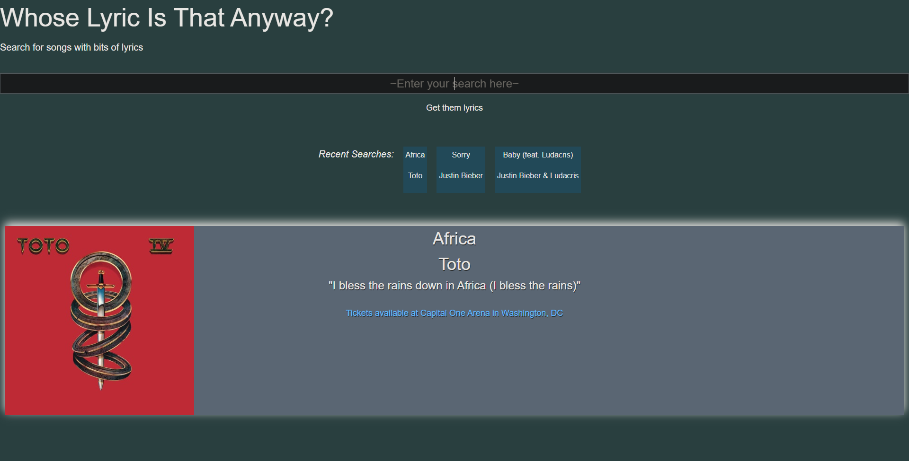

# Lyric-Finder

## Description

This application will allow you to search for a song via name of song or lyric snippet. The search result will have the song title, artist, and any nearby concert where the artist is performing. There will be a link to seatgeek if there are any said concert(s). Your three most recent searches will also be saved via local storage.

## User Story

As a music connoisseur 

I want to research songs by typing in the title of the track or partial lyrics

So that I can find relevant information regarding the search and see any nearby concerts where the relevant artist is performing. 

## Technologies Used

-HTML, CSS, Foundation, and JS

-API's: Shazam and SeatGeek

## Installation

The links below will redirect to the deployed website and related repository:

[Repository](https://github.com/dberry38/octo-quacamole)

[Deployed Site](https://dberry38.github.io/octo-quacamole/)

## Usage

On the deployed website, type a song or lyric snippet into the search bar. A search result with the relevant information will appear. It will display

the song title, artist name, and if there are any nearby concert where the artist will be performing. If there is a concert nearby, clicking the link will take you directly to the artist/concert page where you will be able to purchase tickets. 

  
 
 
## Credits

[Alex Lee](https://github.com/ayesslee)

[Alice Nouhouemale](https://github.com/Alicenouhouemale)

[Amanda Kautzky](https://github.com/AmandaDaria91)

[David Berry](https://github.com/dberry38)

## License

N/A
